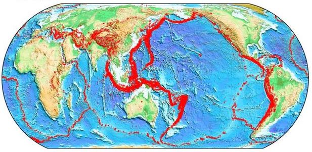
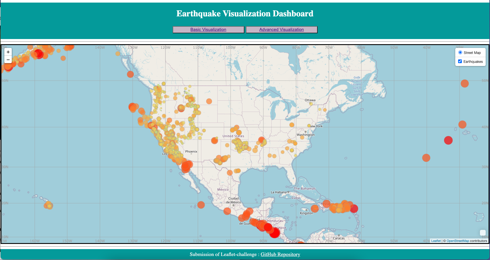
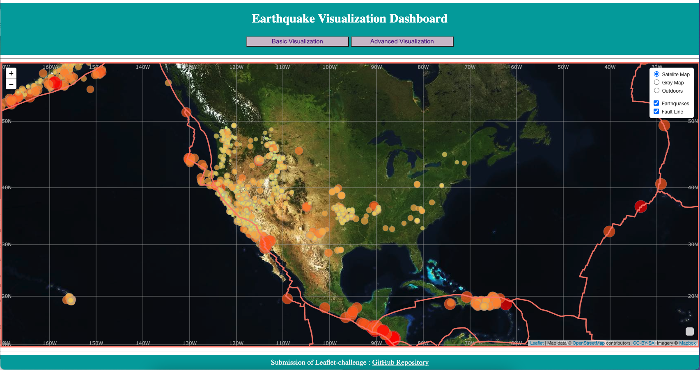

# Data Visualization with Leaftlet

[source: https://img.huffingtonpost.com/asset/605e7ded390000e128eb2474.jpg?ops=crop_7_362_1563_915,scalefit_630_noupscale](https://img.huffingtonpost.com/asset/605e7ded390000e128eb2474.jpg?ops=crop_7_362_1563_915,scalefit_630_noupscale)

## Background

This assigment aims to showcase skills in geological data visualization. Geological data displayed on the maps in this repository are obtained from: 

1. Earthquake dataset is from [USGS GeoJSON Feed.](https://earthquake.usgs.gov/earthquakes/feed/v1.0/geojson.php)

2. Tectonic plates dataset is from [ https://github.com/fraxen/tectonicplates.]( https://github.com/fraxen/tectonicplates)

## Basic Earthquakes Visualization

In this step: 

* Using Html, CSS, JavaScript and Leaftlet to render the final map and layers.
* Base map was create by using tile layer from [OpenStreetMap](https://www.openstreetmap.org/#map=5/38.007/-95.844)
* Earthquake data of worth 30 days is obtained by using D3 json API call. Then earthquake geoJSON data is hold in to overlay layer.
* In addition, lat and long graticule lines are added using js library called [Leaflet.Graticule.js](https://github.com/Leaflet/Leaflet.Graticule)

* The visualization page is deployed on GitHub page: [Basic Visualization](https://kesavanh.github.io/leaflet-challenge/Step-1/index1.html)

## Advanced Earthquakes Visualization 

Further from the step one above, in this step:

* Base map was created by using [mapbox.com](https://docs.mapbox.com/api/maps/) including different layers: satelite layer, ligt scale and outdoor layer.
* Tectonic plates line was created as a layer, the dataset was obtained from [ https://github.com/fraxen/tectonicplates.]( https://github.com/fraxen/tectonicplates)

* The visualization page is deployed on GitHub page: [Advance Visualization](https://kesavanh.github.io/leaflet-challenge/Step-2/index2.html)

